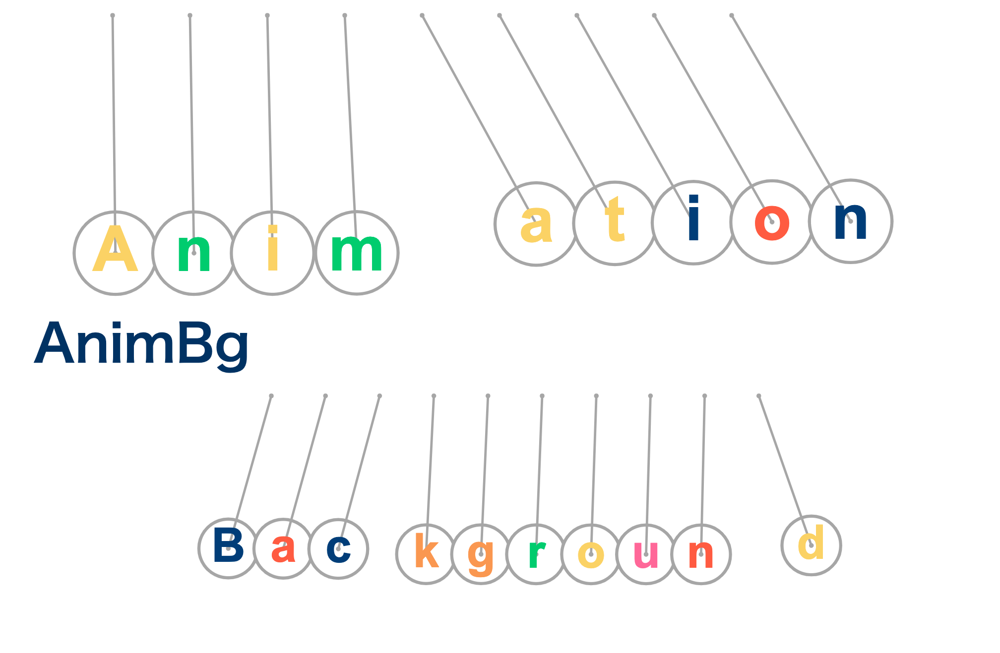

# AnimBg
## What's this?
Animation Background for webpages.

[](https://github.com/e-eq-mc2/AnimBg)


## How to use

```js
<script src="https://cdn.jsdelivr.net/gh/e-eq-mc2/AnimBg/dist/animbg.min.js"></script>
<scipt> 
const nc = new AnimBg.NewtonsCradle({
  el: "#animation-bg",
  minHeight: 200.00,
  minWidth: 200.00,
  scale: 1.00,
  scaleMobile: 1.00,
  backgroundColor: 0x00ffff
})
</script>
````

That's it!

## Credits
Vanta JS from https://github.com/tengbao/vanta
Matter.js from https://github.com/liabru/matter-js
