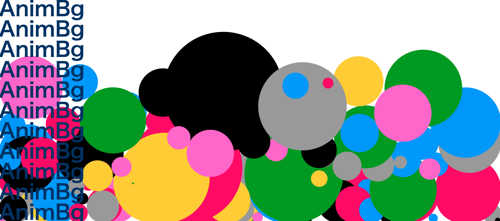

# AnimBg
## What's this?
Animation Background for webpages.

[](https://github.com/e-eq-mc2/AnimBg)
[](https://github.com/e-eq-mc2/AnimBg)


## How to use

### NewtonsCradle
```html
<script src="https://cdn.jsdelivr.net/gh/e-eq-mc2/animbg/dist/animbg.min.js"></script>
<script> 
AnimBg.NewtonsCradle.run({
  el: "#animation-bg",
  boundsScale: {x: 1.05, y: 1.05},
  bodyColors: ['#999999',  '#ffffff', '#000000', '#ff0066', '#ff66cc', '#0099ff', '#009900', '#ffcc00',],
  textColors: ['#f19648', '#f5d259', '#f55a3c', '#063e7b', '#00cc66', '#ff6699'],
  newtonsCradles: [
    {
      baseX: 150, baseY: 20, size: 40, length: 300,
      bodyLineWidth:       8, bodyLineColor:       '#a6a6a6',
      constraintLineWidth: 3, constraintLineColor: '#a6a6a6',
      text: "Animation", font: '800 60px Arial',
    },
    {
      baseX: 350, baseY: 500, size: 30, length: 200,
      bodyLineWidth:       8, bodyLineColor:       '#a6a6a6',
      constraintLineWidth: 3, constraintLineColor: '#a6a6a6',
      text: "Background", font: '800 50px Arial',
    },
  ]
})
</script>
````

### Balls
```html
AnimBg.Balls.run({
  el: "#animation-bg",
  dropInterval: 500, // milliseconds
  maxBodies:    100,
  bodyColors: ['#000000', '#999999', '#ff0066', '#ff66cc', '#0099ff', '#009900', '#ffcc00',],
  })
)
````

That's it!

## Credits
- Vanta JS from https://github.com/tengbao/vanta
- Matter.js from https://github.com/liabru/matter-js
